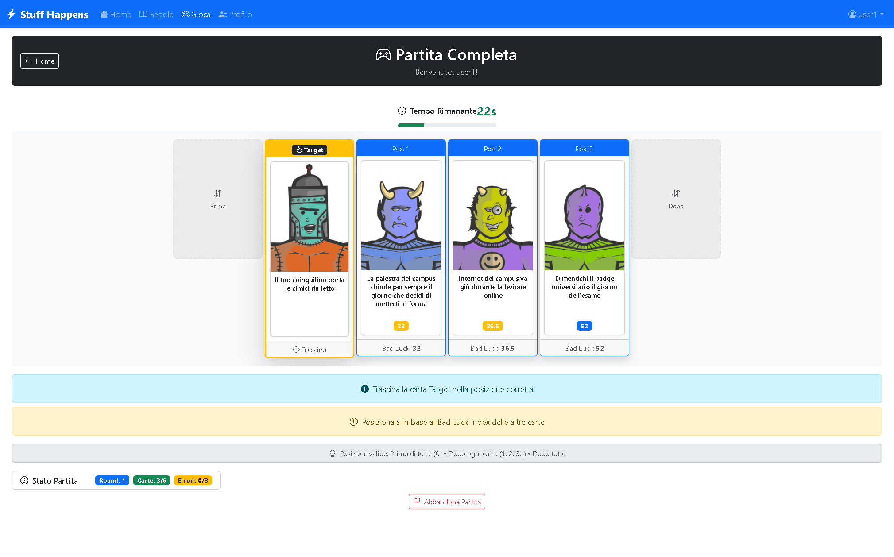

[](https://classroom.github.com/a/ArqHNgsV)

[](https://github.com/SimoneMoreWare/Stuff-Happens-WebApp/releases)
[](https://github.com/SimoneMoreWare/Stuff-Happens-WebApp)
[](https://stuff-happens-web-app.vercel.app/)

# Exam #1: "Stuff Happens"
## Student: s337165 Candido Simone pio

## React Client Application Routes

- Route `/`: Main homepage with game introduction, navigation options, and different interfaces for authenticated vs anonymous users. Shows welcome message and quick access to demo or full game.
- Route `/login`: Authentication page with login form for registered users. Redirects to home if already authenticated. Includes test credentials and demo access links.
- Route `/game`: Main game interface that adapts based on user authentication - full game mode for logged users with complete rounds and persistence, demo mode for anonymous users with single round gameplay.
- Route `/profile`: Protected route for authenticated users only. Displays user statistics, game history with detailed match information, and navigation to start new games.
- Route `/instructions`: Game rules and tutorial page accessible to all users. Explains game mechanics, objectives, and differences between demo and full game modes.
- Route `*`: 404 error page for invalid routes with navigation back to home.

## API Server

### **Authentication APIs**

#### POST `/api/sessions`
**Purpose:** User login and session creation
- **Request body:** `{ "username": "string", "password": "string" }`
- **Response (201):** `{ "id": number, "username": "string", "email": "string" }`
- **Response (401):** `{ "message": "Incorrect username or password." }`
- **Status codes:** 201 (success), 401 (invalid credentials), 500 (server error)

#### GET `/api/sessions/current`
**Purpose:** Get current authenticated user information
- **Request parameters:** None
- **Response (200):** `{ "id": number, "username": "string", "email": "string" }`
- **Response (401):** `{ "error": "Not authenticated" }`
- **Status codes:** 200 (authenticated), 401 (not authenticated)

#### DELETE `/api/sessions/current`
**Purpose:** User logout and session destruction
- **Request parameters:** None
- **Response (200):** Empty body
- **Status codes:** 200 (logout successful)

### **Demo Game APIs (Anonymous Users)**

#### POST `/api/demo/start`
**Purpose:** Start a single-round demo game for anonymous users
- **Request body:** `{ "theme": "university_life" }` (optional, defaults to "university_life")
- **Response (200):**
```json
{
  "initialCards": [
    {
      "id": number,
      "name": "string",
      "image_url": "string",
      "bad_luck_index": number,
      "theme": "string",
      "created_at": "string"
    }
  ],
  "targetCard": {
    "id": number,
    "name": "string",
    "image_url": "string",
    "theme": "string"
  },
  "message": "string",
  "isDemo": true
}
```
- **Response (422):** `{ "errors": [{ "msg": "string", "path": "string" }] }`
- **Response (500):** `{ "error": "Not enough cards available for demo game" }`
- **Status codes:** 200 (success), 422 (validation error), 500 (insufficient cards)

#### POST `/api/demo/guess`
**Purpose:** Submit a guess for the demo game
- **Request body:**
```json
{
  "targetCardId": number,
  "initialCardIds": [number, number, number],
  "position": number,
  "timeElapsed": number
}
```
- **Response (200):**
```json
{
  "correct": boolean,
  "correctPosition": number,
  "timeUp": boolean,
  "targetCard": { /* complete card with bad_luck_index */ },
  "initialCards": [ /* complete cards with bad_luck_index */ ],
  "message": "string",
  "explanation": "string"
}
```
- **Response (422):** `{ "errors": [{ "msg": "string", "path": "string" }] }`
- **Status codes:** 200 (guess processed), 422 (validation error), 500 (database error)

### **Full Game APIs (Authenticated Users Only)**

#### POST `/api/games`
**Purpose:** Create a new full game for authenticated users
- **Authentication:** Required
- **Request body:** `{ "theme": "university_life" }` (optional)
- **Response (201):**
```json
{
  "game": {
    "id": number,
    "user_id": number,
    "status": "playing",
    "cards_collected": number,
    "wrong_guesses": number,
    "current_round": number,
    "created_at": "string",
    "completed_at": null
  },
  "initialCards": [ /* array of 3 initial cards */ ],
  "message": "Full game created successfully"
}
```
- **Response (400):** `{ "error": "You already have an active game. Complete it before starting a new one.", "activeGameId": number }`
- **Response (401):** `{ "error": "Not authorized" }`
- **Status codes:** 201 (created), 400 (active game exists), 401 (not authenticated), 422 (validation error), 500 (database error)

#### GET `/api/games/current`
**Purpose:** Get the user's current active game
- **Authentication:** Required
- **Response (200):**
```json
{
  "game": { /* game object */ },
  "wonCards": [ /* array of won cards with details */ ]
}
```
- **Response (204):** No content (no active game found)
- **Status codes:** 200 (active game found), 204 (no active game), 401 (not authenticated), 500 (database error)

#### GET `/api/games/history`
**Purpose:** Get user's completed games history
- **Authentication:** Required
- **Response (200):** Array of completed games with card details and results
```json
[
  {
    "id": number,
    "status": "won|lost",
    "cards_collected": number,
    "cards": [
      {
        "name": "string",
        "bad_luck_index": number,
        "round_number": number,
        "won": boolean
      }
    ]
  }
]
```
- **Status codes:** 200 (success), 401 (not authenticated), 500 (database error)

#### POST `/api/games/{id}/next-round`
**Purpose:** Start the next round by providing a new card to guess
- **Authentication:** Required
- **Request parameters:** `id` (game ID)
- **Response (200):**
```json
{
  "roundCard": {
    "id": number,
    "name": "string",
    "image_url": "string",
    "theme": "string",
    "gameCardId": number,
    "round_number": number
  },
  "message": "string"
}
```
- **Response (400):** `{ "error": "Game not active" }` or `{ "error": "Game already won/lost" }`
- **Response (403):** `{ "error": "You can only play your own games" }`
- **Status codes:** 200 (success), 400 (invalid state), 403 (not your game), 404 (game not found), 422 (validation error), 500 (database error)

#### POST `/api/games/{id}/guess`
**Purpose:** Submit a guess for the current round with server-side timer validation
- **Authentication:** Required
- **Request parameters:** `id` (game ID)
- **Request body:**
```json
{
  "gameCardId": number,
  "position": number
}
```
- **Response (200):**
```json
{
  "correct": boolean,
  "correctPosition": number,
  "actualTimeElapsed": number,
  "gameStatus": "playing|won|lost",
  "game": { /* updated game object */ },
  "revealed_card": { /* complete card with bad_luck_index */ },
  "message": "string",
  "reason": "time_up_server" /* optional */
}
```
- **Response (400):** Various game state errors (card already played, wrong round, etc.)
- **Status codes:** 200 (processed), 400 (invalid state), 403 (not your game), 422 (validation error), 500 (database error)

#### POST `/api/games/{id}/timeout`
**Purpose:** Handle when a round times out without a guess
- **Authentication:** Required
- **Request parameters:** `id` (game ID)
- **Request body:** `{ "gameCardId": number }`
- **Response (200):**
```json
{
  "correct": false,
  "isTimeout": true,
  "correctPosition": number,
  "gameStatus": "playing|lost",
  "game": { /* updated game object */ },
  "revealed_card": { /* complete card */ },
  "message": "string"
}
```
- **Status codes:** 200 (processed), 400 (invalid state), 403 (not your game), 422 (validation error), 500 (database error)

#### DELETE `/api/games/{id}`
**Purpose:** Abandon an active game
- **Authentication:** Required
- **Request parameters:** `id` (game ID)
- **Response (204):** Empty body
- **Response (400):** `{ "error": "Can only abandon active games" }`
- **Response (403):** `{ "error": "You can only abandon your own games" }`
- **Status codes:** 204 (abandoned), 400 (not active), 403 (not your game), 404 (not found), 422 (validation error), 500 (database error)

## Database Tables

- Table `Users` - contains registered users with authentication credentials. Columns: id (PK), username (unique), email (unique), password (hashed), salt, created_at. Supports login functionality for accessing game history and persistent gameplay.

- Table `Cards` - contains horrible situations for the University Life theme. Columns: id (PK), name, image_url, bad_luck_index (unique, 1-100), theme, created_at. Each card has a unique bad_luck_index with minimum 0.5 difference between values as required by game specifications.

- Table `Games` - tracks individual game sessions and their current state. Columns: id (PK), user_id (FK, nullable for anonymous users), status (playing/won/lost), cards_collected, wrong_guesses, current_round, created_at, completed_at. Supports both registered and anonymous gameplay modes.

- Table `GameCards` - manages the relationship between games and cards, tracking which cards are dealt in each round. Columns: id (PK), game_id (FK), card_id (FK), round_number, guessed_correctly, position_guessed, is_initial, played_at, card_dealt_at. Handles both initial 3-card setup and subsequent round cards with guess tracking.

## Main React Components

- `GameBoard` (in `GameBoard.jsx`): Main game dispatcher component that implements Strategy Pattern to route between demo and full game modes based on user authentication status.
- `FullGameBoard` (in `FullGameBoard.jsx`): Complete game experience for authenticated users with multi-round gameplay, drag-and-drop card positioning, timer integration, and game state persistence.
- `DemoGameBoard` (in `DemoGameBoard.jsx`): Simplified single-round game mode for anonymous users with basic drag-and-drop functionality and result display without persistence.
- `ProfilePage` (in `ProfilePage.jsx`): User profile interface displaying personal statistics and game history with navigation to start new games and logout functionality.
- `LoginForm` (in `LoginForm.jsx`): Controlled authentication form component with input validation, error handling, and proper form submission following React best practices.
- `GameHistory` (in `GameHistory.jsx`): Displays chronological list of completed games with expandable details showing cards involved, round outcomes, and game statistics.
- `UserStats` (in `UserStats.jsx`): Statistical dashboard showing win/loss ratios, total games played, average cards collected, and performance metrics with visual progress indicators.
- `GameSummary` (in `GameSummary.jsx`): End-game summary displaying final results, collected cards, performance analysis, and navigation options for new games or profile access.
- `RoundResult` (in `RoundResult.jsx`): Round outcome feedback component showing correct/incorrect guess results, revealed card information, and continuation options with context-aware messaging.
- `CardDisplay` (in `CardDisplay.jsx`): Reusable card visualization component displaying card image, name, and optional bad luck index with loading states and error handling.
- `Timer` (in `Timer.jsx`): Game timer component with visual countdown, progress bar, and warning alerts for remaining time during 30-second rounds.

## Screenshot




## Users Credentials

- user1, password (email: u1@p.it) - regular user with completed game history including both won and lost games
- user2, password (email: u2@p.it) - regular user for testing login functionality and new game sessions